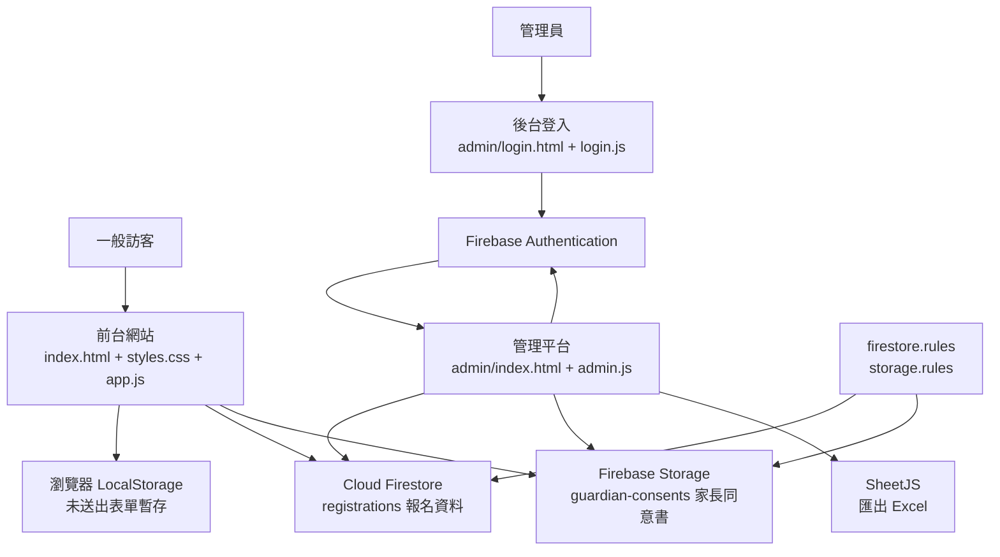
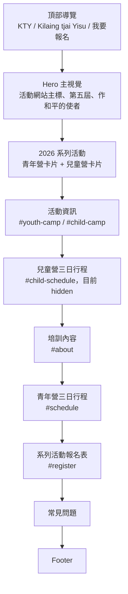
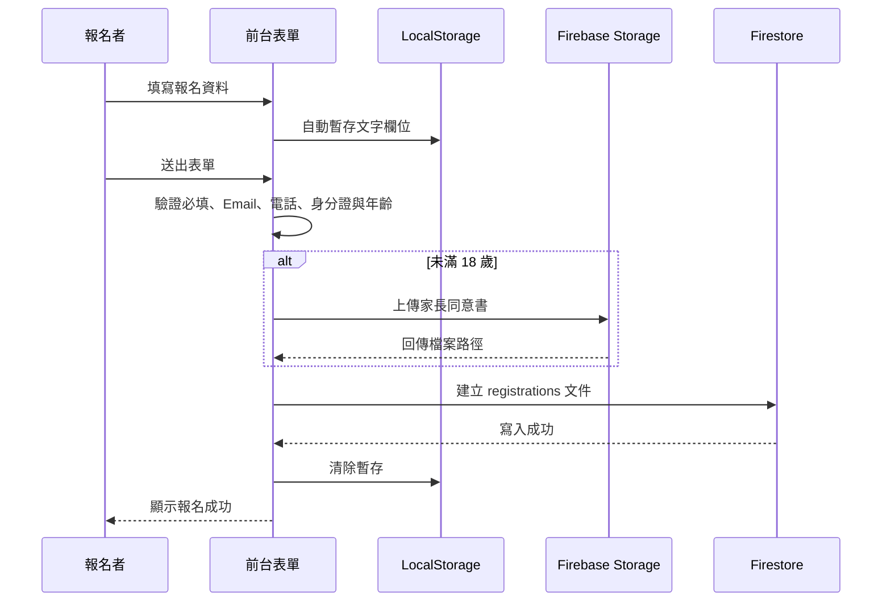
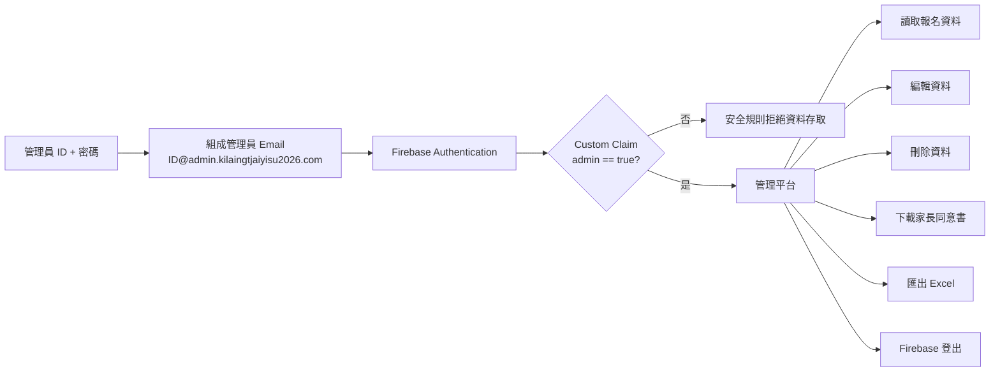

# 2026 Kilaing tjai Yisu 活動網站架構

## 1. 系統架構圖



## 2. 前台頁面結構



### 主要互動

- 活動卡片使用錨點連至 `#youth-camp` 與 `#child-camp`。
- 網站使用 CSS `scroll-behavior: smooth` 平滑捲動。
- 青年營日程卡顯示重點，完整內容使用共用 `<dialog>` 彈窗。
- 兒童營日程與完整內容已建置，但整區目前使用 `hidden` 隱藏。
- 未滿 18 歲者必須下載、簽署並上傳家長同意書。
- 表單填寫內容會暫存於使用者瀏覽器，成功送出後清除。

## 3. 報名資料流程



## 4. 後台管理流程



## 5. Firebase 資料結構

### Firestore

```text
registrations/{registrationId}
├─ camp
├─ name
├─ gender
├─ nationalId
├─ birthDate
├─ age
├─ isMinor
├─ address
├─ phone
├─ email
├─ church
├─ transport / transportOther
├─ diet / dietOther
├─ shirtSize
├─ hasGuardianConsent
├─ guardianConsentPath
├─ guardianConsentUrl
├─ termsAccepted
└─ createdAt
```

### Storage

```text
guardian-consents/
└─ {registrationId}/
   └─ {timestamp}-{sanitizedFileName}
```

### 權限

- 公開使用者可以建立符合欄位規則的報名資料。
- 公開使用者可以上傳符合格式與大小限制的同意書。
- 只有 Firebase Token 含有 `admin: true` 的管理員可以讀取、修改或刪除資料。

## 6. 專案檔案

```text
/
├─ index.html                 前台頁面與所有活動區塊
├─ styles.css                前台與響應式樣式
├─ app.js                    前台表單、驗證、日程彈窗與 Firebase 寫入
├─ firebase.js               Firebase 初始化
├─ firestore.rules           Firestore 安全規則
├─ storage.rules             Storage 安全規則
├─ firebase.json             Firebase 規則設定
├─ images/                   Hero、海報與培訓圖片
├─ downloads/
│  └─ guardian-consent-form.png
├─ admin/
│  ├─ login.html             後台登入頁
│  ├─ login.css
│  ├─ login.js               Firebase 帳密登入
│  ├─ index.html             後台管理頁
│  ├─ admin.css
│  └─ admin.js               查詢、編輯、刪除、下載、匯出與登出
└─ components/
   ├─ CampSchedule.jsx
   └─ TrainingJourney.jsx
```

> `components/*.jsx` 目前沒有被 `index.html` 或 JavaScript 載入；正式網站主要由原生 HTML、CSS 與 JavaScript 組成。

